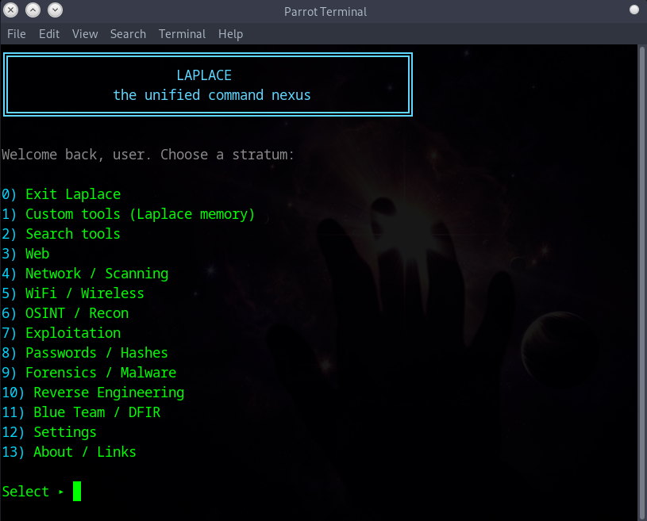

# Laplace Nexus CLI





Laplace is a modular, aesthetic command-line nexus for Linux.

It gives a unified menu over common cybersecurity, OSINT, networking, forensics, reverse-engineering and blue-team tools, with:

- categorized menus
- tool search bar
- themes
- optional password lock
- auto-install of missing tools (via apt)
- custom tools (Laplace memory)
- self-update using git
- About panel with GitHub / Discord identity

# One-line install (recommended)
```
curl -fsSL https://raw.githubusercontent.com/vireline/laplace-nexus-cli/main/install.sh | bash
```

## Installation

```
git clone https://github.com/vireline/laplace-nexus-cli.git
cd laplace-nexus-cli
chmod +x laplace.sh
./laplace.sh
```

## Install globally

```
cd laplace-nexus-cli
chmod +x install.sh
./install.sh
laplace
```

## Plugins

Laplace can load tools from plugin files stored in the repo:
- `plugins/*.plugin`

Format (one per line):
category|tool|description|example

Example:
web|gobuster|Directory brute-forcer.|gobuster dir -u http://target
 -w wordlist.txt
Plugin entries are read-only inside the UI and must be edited by modifying the plugin file.

## Changelog

### v0.3.1
- First public GitHub release
- Added gobuster integration
- Added About panel with identity and self-update
- Added README, screenshots, badges, and MIT license

